# Advanced Self-Aware Personal Assistant Bot Architecture

## Table of Contents

1. [Overview](#1-overview)
2. [Project Structure](#2-project-structure)
3. [Core Module Interfaces and Responsibilities](#3-core-module-interfaces-and-responsibilities)
   - [Module Boundaries and Responsibilities](#31-module-boundaries-and-responsibilities)
   - [Module Interactions](#32-module-interactions)
4. [Sequence Diagrams](#4-sequence-diagrams)
   - [User Command Processing Sequence](#41-user-command-processing-sequence)
   - [Self-Healing Sequence](#42-self-healing-sequence)
   - [External API Integration Sequence](#43-external-api-integration-sequence)
5. [Technical Challenges and Dependencies](#5-technical-challenges-and-dependencies)
   - [Dependencies](#51-dependencies)
   - [Technical Challenges](#52-technical-challenges)
6. [Configuration Management](#6-configuration-management)
7. [Logging Architecture](#7-logging-architecture)
8. [CLI Interface](#8-cli-interface)
9. [Data Flow](#9-data-flow)
10. [Error Handling Strategy](#10-error-handling-strategy)
11. [Data Persistence and State Management](#11-data-persistence-and-state-management)
    - [Database Architecture](#111-database-architecture)
    - [State Management Architecture](#112-state-management-architecture)
    - [In-Memory State Structure](#113-in-memory-state-structure)
    - [Caching Strategy](#114-caching-strategy)
    - [State Synchronization](#115-state-synchronization)
    - [Data Serialization](#116-data-serialization)
    - [Transaction Management](#117-transaction-management)
    - [Recovery and Resilience](#118-recovery-and-resilience)
12. [Deployment Strategy](#12-deployment-strategy)
    - [Containerization Architecture](#121-containerization-architecture)
    - [Orchestration Strategy](#122-orchestration-strategy)
    - [Scalability Considerations](#123-scalability-considerations)
    - [CI/CD Pipeline](#124-cicd-pipeline)
    - [Environment Management](#125-environment-management)
    - [Infrastructure as Code](#126-infrastructure-as-code)
    - [Monitoring and Observability](#127-monitoring-and-observability)
    - [Disaster Recovery](#128-disaster-recovery)
13. [Future Enhancements and Architecture Evolution](#13-future-enhancements-and-architecture-evolution)
    - [Architectural Evolution Roadmap](#131-architectural-evolution-roadmap)
    - [Enhanced Self-Awareness Capabilities](#132-enhanced-self-awareness-capabilities)
    - [Advanced Self-Healing Techniques](#133-advanced-self-healing-techniques)
    - [Edge and Distributed Computing](#134-edge-and-distributed-computing)
    - [Advanced User Interfaces](#135-advanced-user-interfaces)
    - [Security Evolution](#136-security-evolution)
    - [Integration Ecosystem Expansion](#137-integration-ecosystem-expansion)
    - [Architectural Patterns Evolution](#138-architectural-patterns-evolution)
    - [Technical Debt Management Strategy](#139-technical-debt-management-strategy)
    - [Research Opportunities](#1310-research-opportunities)

## 1. Overview

This document outlines the architecture for an advanced personal assistant bot with self-awareness, self-healing capabilities, and AI text detection. The system will be deployed as a standalone application with a GUI and expose webhooks for event-driven interactions with external systems.

## 2. Project Structure

Here's the proposed project structure with all necessary folders and files:

```
self-aware-assistant/
├── pyproject.toml                  # Poetry dependency management
├── README.md                       # Project documentation
├── .env.example                    # Example environment variables
├── .gitignore                      # Git ignore file
├── config/
│   ├── default.yaml                # Default configuration
│   ├── development.yaml            # Development environment config
│   ├── production.yaml             # Production environment config
│   └── testing.yaml                # Testing environment config
├── logs/                           # Log files directory
├── data/
│   ├── models/                     # AI models storage
│   ├── training/                   # Training data
│   └── cache/                      # Cache data
├── scripts/
│   ├── setup.py                    # Setup script
│   └── generate_docs.py            # Documentation generator
├── docs/
│   ├── api/                        # API documentation
│   ├── user_guide/                 # User guide
│   └── developer_guide/            # Developer documentation
├── tests/
│   ├── unit/                       # Unit tests
│   │   ├── test_self_aware.py
│   │   ├── test_self_healing.py
│   │   ├── test_command_interface.py
│   │   ├── test_text_humanization.py
│   │   └── test_ai_detection.py
│   ├── integration/                # Integration tests
│   │   ├── test_module_interaction.py
│   │   └── test_external_api.py
│   └── system/                     # System tests
│       └── test_end_to_end.py
├── src/
│   ├── __init__.py
│   ├── main.py                     # Application entry point
│   ├── cli.py                      # CLI interface
│   ├── gui/                        # GUI components
│   │   ├── __init__.py
│   │   ├── app.py                  # Main GUI application
│   │   ├── views/                  # UI views
│   │   └── controllers/            # UI controllers
│   ├── api/                        # API endpoints
│   │   ├── __init__.py
│   │   ├── routes.py               # API route definitions
│   │   └── webhooks.py             # Webhook handlers
│   ├── core/                       # Core modules
│   │   ├── __init__.py
│   │   ├── self_aware_module.py    # Self-awareness capabilities
│   │   ├── self_healing_coding_module.py  # Self-healing capabilities
│   │   ├── command_interface.py    # Command processing
│   │   ├── text_humanization_module.py  # Text humanization
│   │   └── ai_text_detection_module.py  # AI text detection
│   ├── integrations/               # External integrations
│   │   ├── __init__.py
│   │   ├── calendar_integration.py
│   │   ├── email_integration.py
│   │   ├── task_integration.py
│   │   ├── messaging_integration.py
│   │   ├── nlp_services.py
│   │   ├── storage_integration.py
│   │   └── notification_services.py
│   ├── utils/                      # Utility functions
│   │   ├── __init__.py
│   │   ├── config_manager.py       # Configuration management
│   │   ├── logger.py               # Extended logging functionality
│   │   ├── error_handler.py        # Error handling utilities
│   │   └── validators.py           # Input validation
│   └── models/                     # Data models
│       ├── __init__.py
│       ├── user_model.py           # User data model
│       ├── conversation_model.py   # Conversation data model
│       ├── task_model.py           # Task data model
│       └── system_state_model.py   # System state model
```

## 3. Core Module Interfaces and Responsibilities

### 3.1 Module Boundaries and Responsibilities

#### Self-Awareness Module (`self_aware_module.py`)

**Responsibilities:**
- Monitor emotional intelligence metrics
- Maintain an internal model of capabilities, limitations, and state
- Track performance and response appropriateness
- Learn from past interaction patterns
- Analyze system resources and execution patterns
- Detect potential failure points and inefficiencies

**Key Interfaces:**
```python
class SelfAwareModule:
    def analyze_state(self) -> SystemState
    def evaluate_response(self, response: str, context: Context) -> EvaluationResult
    def learn_from_interaction(self, interaction: Interaction) -> None
    def get_capability_status(self) -> Dict[str, CapabilityStatus]
    def introspect_code(self, module_name: str) -> CodeAnalysisResult
    def register_observer(self, observer: SelfAwareObserver) -> None
```

#### Self-Healing and Self-Coding Module (`self_healing_coding_module.py`)

**Responsibilities:**
- Fix detected code issues automatically
- Generate optimized code solutions
- Deploy patches to its own codebase
- Manage code versioning and rollbacks
- Validate code changes before deployment
- Handle runtime exceptions gracefully

**Key Interfaces:**
```python
class SelfHealingCodingModule:
    def diagnose_issue(self, error: Exception) -> IssueAnalysis
    def generate_fix(self, issue: IssueAnalysis) -> CodePatch
    def apply_patch(self, patch: CodePatch) -> PatchResult
    def rollback_changes(self, version: str) -> RollbackResult
    def optimize_code(self, module_path: str) -> OptimizationResult
    def verify_system_integrity(self) -> SystemIntegrityReport
```

#### Command Interface Module (`command_interface.py`)

**Responsibilities:**
- Parse and interpret user commands
- Route commands to appropriate handlers
- Manage command history and context
- Handle multi-step command sequences
- Provide command suggestions
- Validate command inputs

**Key Interfaces:**
```python
class CommandInterface:
    def parse_command(self, input_text: str) -> Command
    def execute_command(self, command: Command) -> CommandResult
    def get_command_history(self) -> List[CommandEntry]
    def suggest_commands(self, partial_input: str) -> List[CommandSuggestion]
    def register_command_handler(self, command_type: str, handler: CommandHandler) -> None
    def get_command_context(self) -> CommandContext
```

#### Text Humanization Module (`text_humanization_module.py`)

**Responsibilities:**
- Transform AI-generated text to appear more human-like
- Adjust formality, tone, and style based on context
- Add appropriate filler words and natural pauses
- Incorporate linguistic variations and imperfections
- Personalize text based on user preferences
- Maintain consistent persona across interactions

**Key Interfaces:**
```python
class TextHumanizationModule:
    def humanize_text(self, text: str, context: HumanizationContext) -> str
    def set_persona(self, persona: TextPersona) -> None
    def adjust_style(self, style_params: StyleParameters) -> None
    def analyze_human_patterns(self, samples: List[str]) -> PatternAnalysisResult
    def get_available_styles(self) -> List[TextStyle]
    def personalize_for_user(self, user_id: str) -> None
```

#### AI Text Detection Module (`ai_text_detection_module.py`)

**Responsibilities:**
- Detect AI-generated text in user inputs
- Classify text sources (human vs. various AI models)
- Calculate confidence scores for classifications
- Adapt to new AI text generation techniques
- Maintain a database of AI text patterns
- Report detailed analysis of suspicious text

**Key Interfaces:**
```python
class AITextDetectionModule:
    def detect_ai_text(self, text: str) -> DetectionResult
    def classify_text_source(self, text: str) -> SourceClassification
    def calculate_human_probability(self, text: str) -> float
    def train_detection_model(self, samples: Dict[str, List[str]]) -> TrainingResult
    def analyze_text_patterns(self, text: str) -> PatternAnalysis
    def update_pattern_database(self) -> UpdateResult
```

### 3.2 Module Interactions

The five core modules interact in complex ways to provide a cohesive system:

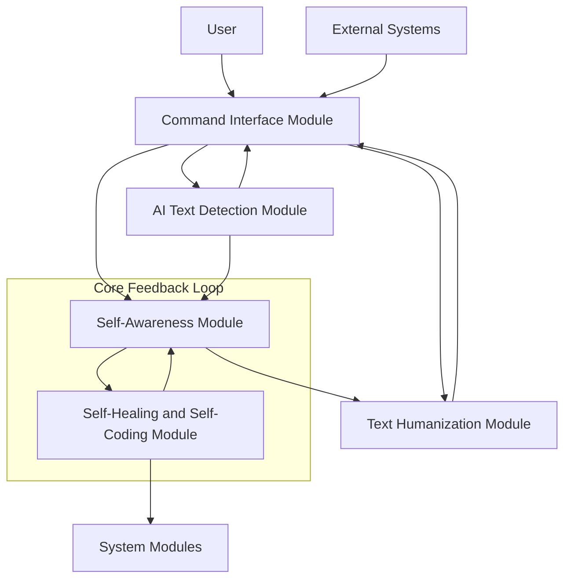

## 4. Sequence Diagrams

### 4.1 User Command Processing Sequence

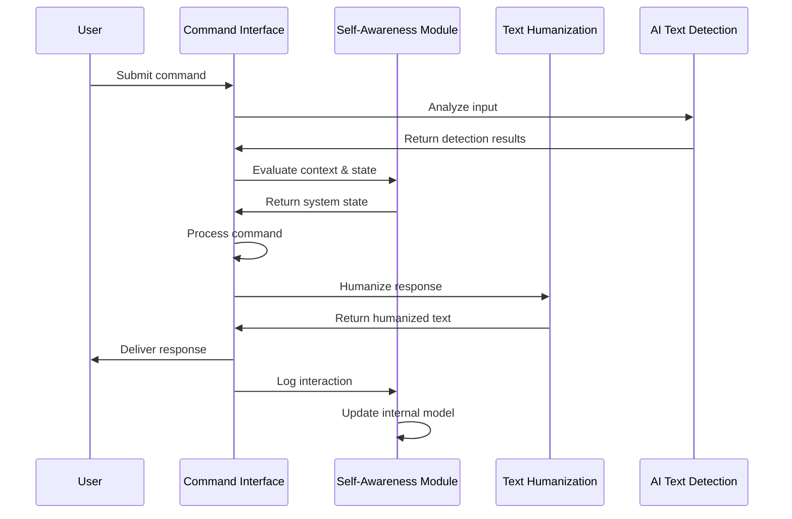

### 4.2 Self-Healing Sequence

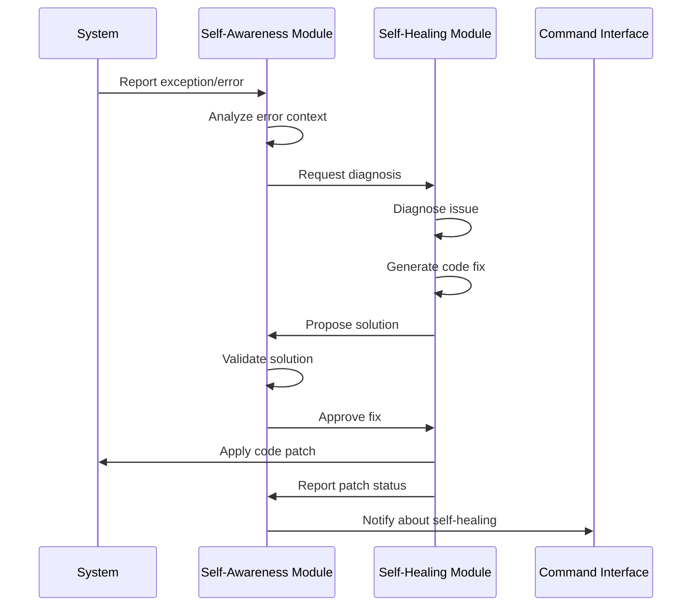

### 4.3 External API Integration Sequence

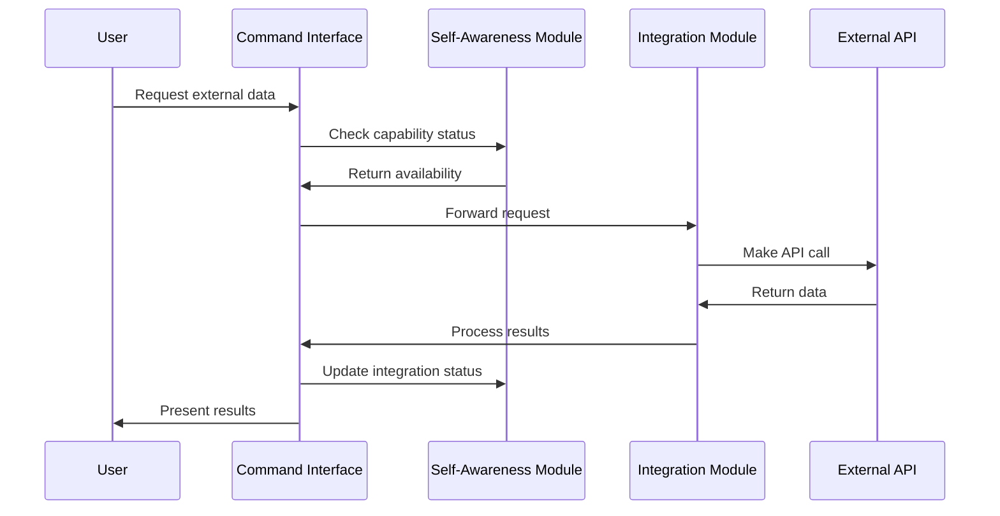

## 5. Technical Challenges and Dependencies

### 5.1 Dependencies

**Core Dependencies:**
```toml
[tool.poetry.dependencies]
python = "^3.9"
pydantic = "^1.9.0"
fastapi = "^0.75.0"
uvicorn = "^0.17.6"
loguru = "^0.6.0"
pyyaml = "^6.0"
sqlalchemy = "^1.4.35"
alembic = "^1.7.7"
pytest = "^7.1.1"
requests = "^2.27.1"
aiohttp = "^3.8.1"
python-dotenv = "^0.20.0"
typer = "^0.4.1"
rich = "^12.2.0"
transformers = "^4.18.0"
torch = "^1.11.0"
numpy = "^1.22.3"
nltk = "^3.7"
scikit-learn = "^1.0.2"
```

**Integration Dependencies:**
```toml
[tool.poetry.dependencies]
google-api-python-client = "^2.43.0"
google-auth-httplib2 = "^0.1.0"
google-auth-oauthlib = "^0.5.1"
slack-sdk = "^3.15.2"
discord.py = "^1.7.3"
todoist-api-python = "^2.0.1"
asana = "^0.10.3"
boto3 = "^1.21.46"
twilio = "^7.8.2"
sendgrid = "^6.9.7"
```

### 5.2 Technical Challenges

1. **Self-Awareness Implementation**
   - Challenge: Creating a truly introspective system that can model its own capabilities
   - Mitigation: Start with limited self-modeling focused on performance metrics and gradually increase sophistication

2. **Self-Healing Code Generation**
   - Challenge: Safely generating and applying code fixes without introducing new issues
   - Mitigation: Implement extensive validation, testing frameworks, and rollback capabilities

3. **Text Humanization Balancing**
   - Challenge: Making text appear human-like without sacrificing clarity or accuracy
   - Mitigation: Develop a configurable system with adjustable humanization levels

4. **AI Text Detection Arms Race**
   - Challenge: Keeping up with rapidly evolving AI text generation techniques
   - Mitigation: Implement a regularly updated model training pipeline and feature extraction system

5. **Integration Complexity**
   - Challenge: Managing diverse external API integrations with different authentication methods
   - Mitigation: Develop a uniform integration interface with adapter patterns for each service

6. **Resource Management**
   - Challenge: Balancing performance with resource usage across complex ML operations
   - Mitigation: Implement adaptive resource allocation and monitoring systems

7. **Security Concerns**
   - Challenge: Ensuring secure handling of credentials and sensitive data
   - Mitigation: Implement zero-trust architecture and proper credential management

## 6. Configuration Management

The system uses a layered configuration approach:

1. **Base Configuration** (YAML files in `/config/`)
   - Default settings for all environments
   - Environment-specific overrides

2. **Environment Variables**
   - Sensitive configuration (API keys, secrets)
   - Deployment-specific settings

3. **Runtime Configuration**
   - User preferences
   - Dynamically adjusted settings

The `ConfigManager` class handles loading, validation, and access to configuration:

```python
class ConfigManager:
    def __init__(self, env: str = "development"):
        self.env = env
        self.config = self._load_config()

    def _load_config(self) -> Dict:
        # Load base config
        # Override with environment config
        # Override with env variables

    def get(self, key: str, default=None):
        # Get config value with dot notation support

    def set_runtime(self, key: str, value: Any):
        # Set runtime configuration
```

## 7. Logging Architecture

The system implements an extended logging functionality:

```python
class LoggingManager:
    def __init__(self, config: ConfigManager):
        self.config = config
        self._setup_logging()

    def _setup_logging(self):
        # Configure loguru with rotation, compression, etc.

    def get_logger(self, name: str) -> Logger:
        # Return configured logger for module

    def capture_exception(self, exc: Exception, context: Dict = None):
        # Log exception with context

    def audit_log(self, user_id: str, action: str, details: Dict):
        # Record audit log entry
```

## 8. CLI Interface

The system provides a CLI interface for administration and direct interaction:

```python
@app.command()
def start(config_file: str = None, debug: bool = False):
    """Start the assistant bot"""

@app.command()
def configure(setting: str, value: str):
    """Configure system settings"""

@app.command()
def status():
    """Check system status"""

@app.command()
def train(module: str, data_path: str):
    """Train a specific module"""
```

## 9. Data Flow

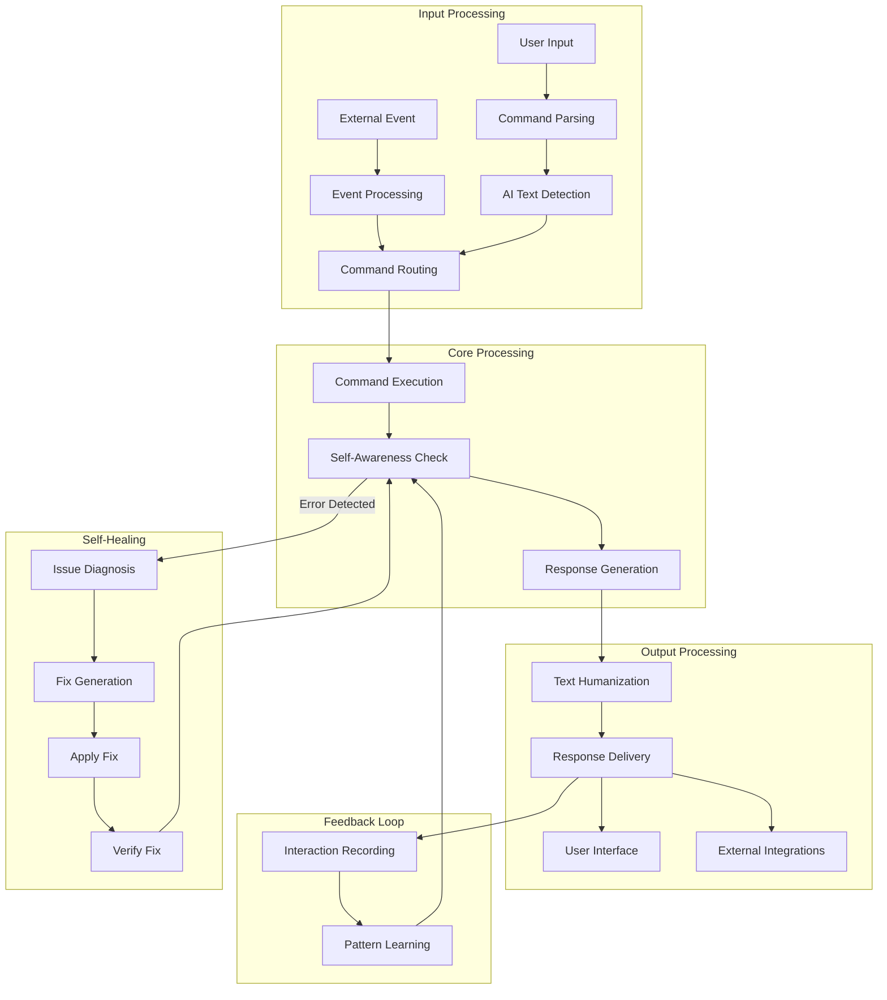

## 10. Error Handling Strategy

The system implements a layered error handling approach:

1. **Local Exception Handling**
   - Each component handles expected exceptions
   - Provides appropriate fallbacks

2. **Global Exception Middleware**
   - Catches unhandled exceptions
   - Routes to self-healing module when appropriate

3. **Self-Healing Pipeline**
   - Analyzes exceptions
   - Generates fixes when possible
   - Applies verified fixes

4. **Graceful Degradation**
   - Disables problematic features
   - Maintains core functionality

```python
@contextmanager
def self_healing_context(module_name: str):
    try:
        yield
    except Exception as e:
        # Log the exception
        logger.exception(f"Error in {module_name}")

        # Try self-healing
        healing_result = self_healing_module.attempt_fix(e, module_name)

        if healing_result.success:
            # Retry operation
            # ...
        else:
            # Gracefully degrade
            # ...
```

## 11. Data Persistence and State Management

### 11.1 Database Architecture

The system implements a multi-tier data persistence strategy:

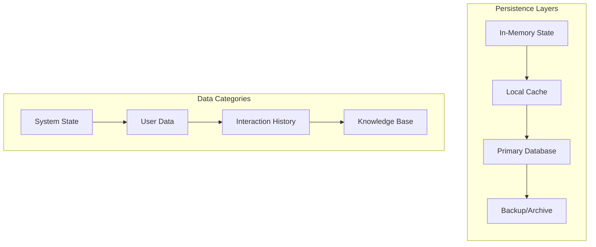

**Database Technology Selection:**
- Primary Database: PostgreSQL for relational data with JSON support
- Cache Layer: Redis for high-performance caching
- Object Storage: For large binary assets and model files
- Document Storage: For unstructured data and conversation logs

**Schema Design:**
```
┌─────────────────┐       ┌─────────────────┐       ┌─────────────────┐
│      Users      │       │  Conversations  │       │   Interactions   │
├─────────────────┤       ├─────────────────┤       ├─────────────────┤
│ id              │       │ id              │       │ id              │
│ name            │───┐   │ user_id         │───┐   │ conversation_id │
│ preferences     │   │   │ start_time      │   │   │ timestamp       │
│ created_at      │   │   │ end_time        │   │   │ content         │
│ updated_at      │   │   │ summary         │   │   │ source          │
└─────────────────┘   │   │ context         │   │   │ metadata        │
                      │   └─────────────────┘   │   └─────────────────┘
                      │                         │
                      └─────────────────────────┘

┌─────────────────┐       ┌─────────────────┐       ┌─────────────────┐
│  System States  │       │ Learning Models │       │    API Keys     │
├─────────────────┤       ├─────────────────┤       ├─────────────────┤
│ id              │       │ id              │       │ id              │
│ timestamp       │       │ model_type      │       │ service         │
│ component       │       │ version         │       │ key_identifier  │
│ state_data      │       │ trained_at      │       │ encrypted_key   │
│ health_status   │       │ parameters      │       │ expiry          │
└─────────────────┘       └─────────────────┘       └─────────────────┘
```

### 11.2 State Management Architecture

The system employs a multi-layered state management approach:

1. **Core State Engine**
   - Manages global application state
   - Implements observer pattern for state change notifications
   - Provides transaction-like state updates

2. **Component State Management**
   - Each module maintains internal state
   - Subscribes to relevant global state changes
   - Publishes state changes to the global state

3. **Persistence Synchronization**
   - Background synchronization to database
   - Optimistic UI updates with rollback capability
   - Conflict resolution for concurrent modifications

**State Update Flow:**
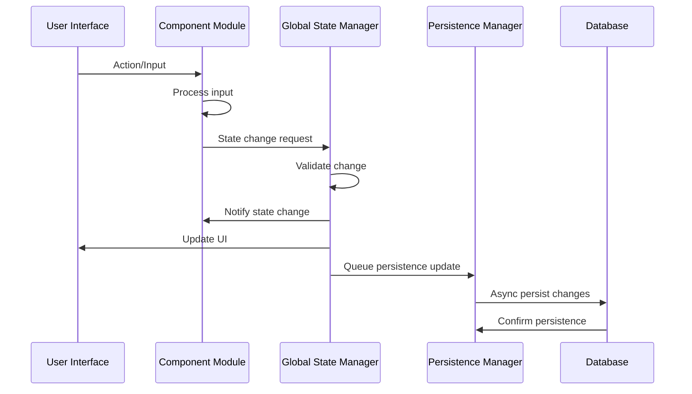

### 11.3 In-Memory State Structure

The in-memory state is organized hierarchically for efficient access:

```
StateTree
├── system
│   ├── health
│   ├── resources
│   └── capabilities
├── user
│   ├── profiles
│   ├── preferences
│   └── sessions
├── modules
│   ├── self_aware
│   ├── self_healing
│   ├── command
│   ├── humanization
│   └── detection
├── integrations
│   ├── calendar
│   ├── email
│   ├── tasks
│   └── messaging
└── interactions
    ├── current
    ├── recent
    └── statistics
```

### 11.4 Caching Strategy

The system implements a multi-level caching strategy:

1. **L1 Cache (Memory)**
   - Frequently accessed data
   - Short TTL (Time-To-Live)
   - Process-local

2. **L2 Cache (Redis)**
   - Shared data between processes
   - Medium TTL
   - Supports clustering

3. **L3 Cache (Database)**
   - Materialized views and computed values
   - Longer TTL
   - Persistent between restarts

**Cache Invalidation:**
- Time-based expiration
- Event-based invalidation
- LRU (Least Recently Used) eviction
- Version tagging for cache coherence

### 11.5 State Synchronization

For distributed deployments, state synchronization is crucial:

```python
class StateSynchronizer:
    def __init__(self, node_id: str, redis_client):
        self.node_id = node_id
        self.redis = redis_client
        self.change_queue = Queue()
        self._start_sync_workers()

    def publish_change(self, state_path: str, value: Any):
        """Publish state change to other nodes"""
        # Generate change ID
        # Serialize change with metadata
        # Publish to Redis channel

    def apply_remote_change(self, change: StateChange):
        """Apply change from another node"""
        # Verify change is not already applied
        # Apply to local state
        # Notify observers

    def _start_sync_workers(self):
        # Start background thread for change publication
        # Start background thread for change subscription
```

### 11.6 Data Serialization

The system uses a flexible serialization strategy:

1. **Protocol Buffers**
   - For high-performance internal data exchange
   - Schema-based with validation
   - Compact binary format

2. **JSON**
   - For API interfaces and configuration
   - Human-readable
   - Schema validation with JSON Schema

3. **Custom Binary Format**
   - For ML model states and large data structures
   - Optimized for size and loading performance

**Serialization Abstraction:**
```python
class SerializationManager:
    def __init__(self, config: ConfigManager):
        self.config = config
        self.serializers = self._init_serializers()

    def _init_serializers(self):
        return {
            'json': JSONSerializer(),
            'protobuf': ProtobufSerializer(),
            'binary': BinarySerializer(),
            'pickle': PickleSerializer(),
        }

    def serialize(self, data: Any, format: str = 'json') -> bytes:
        """Serialize data to the specified format"""
        serializer = self.serializers.get(format)
        return serializer.serialize(data)

    def deserialize(self, data: bytes, format: str = 'json') -> Any:
        """Deserialize data from the specified format"""
        serializer = self.serializers.get(format)
        return serializer.deserialize(data)
```

### 11.7 Transaction Management

For operations that span multiple state changes:

```python
class StateTransaction:
    def __init__(self, state_manager):
        self.state_manager = state_manager
        self.changes = []
        self.old_values = {}

    def update(self, path: str, value: Any):
        """Stage an update within the transaction"""
        old_value = self.state_manager.get(path)
        self.old_values[path] = old_value
        self.changes.append((path, value))

    def commit(self):
        """Apply all changes atomically"""
        # Lock state
        # Apply all changes
        # Notify observers once
        # Unlock state

    def rollback(self):
        """Revert all changes"""
        # Restore old values
```

### 11.8 Recovery and Resilience

To ensure state consistency in case of failures:

1. **Write-Ahead Logging**
   - Record state changes before applying
   - Allows recovery after crash

2. **Periodic Snapshots**
   - Complete state snapshots at intervals
   - Faster recovery for large state

3. **Incremental Backups**
   - Only changes since last snapshot
   - Efficient storage usage

4. **State Verification**
   - Background integrity checks
   - Automatic repair when possible

```python
class StateRecoveryManager:
    def __init__(self, state_manager, persistence_manager):
        self.state_manager = state_manager
        self.persistence_manager = persistence_manager

    def create_snapshot(self):
        """Create complete state snapshot"""
        # Freeze state temporarily
        # Serialize full state
        # Store with timestamp

    def recover_from_crash(self):
        """Restore state after crash"""
        # Load last snapshot
        # Apply logged changes after snapshot
        # Verify integrity
```

## 12. Deployment Strategy

### 12.1 Containerization Architecture

The system is containerized using Docker with a layered approach:

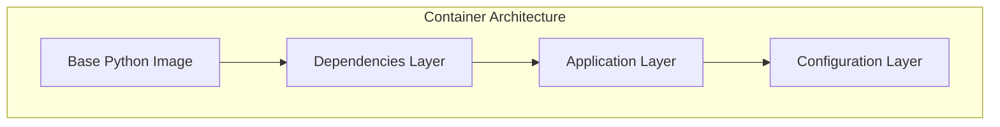

**Dockerfile Structure:**
```dockerfile
# Base Image
FROM python:3.9-slim as base

# Dependencies Layer
FROM base as dependencies
RUN pip install poetry
COPY pyproject.toml poetry.lock ./
RUN poetry export -f requirements.txt > requirements.txt && \
    pip install --no-cache-dir -r requirements.txt

# Application Layer
FROM dependencies as application
COPY src/ /app/src/
COPY config/ /app/config/
WORKDIR /app

# Configuration Layer
FROM application as runtime
COPY docker-entrypoint.sh /
RUN chmod +x /docker-entrypoint.sh
ENTRYPOINT ["/docker-entrypoint.sh"]
CMD ["start"]
```

**Multi-stage builds** are used for:
- Development containers with debugging tools
- Test containers with test dependencies
- Production containers optimized for size and security

**Container Components:**

| Container | Purpose | Scaling Strategy |
|-----------|---------|------------------|
| Core      | Main application logic | Vertical |
| API       | REST/GraphQL API layer | Horizontal |
| Worker    | Background processing | Horizontal |
| Scheduler | Periodic tasks | Single instance with HA |
| UI        | GUI service | Horizontal |
| Database  | Data persistence | Primary-replica |
| Redis     | Caching/messaging | Cluster |

### 12.2 Orchestration Strategy

The system uses Kubernetes for orchestration:

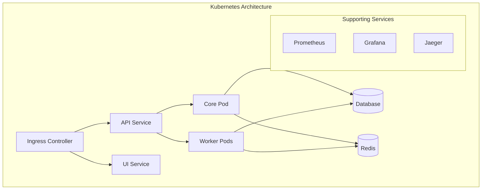

**Key Kubernetes Resources:**
- **Deployments:** For stateless components
- **StatefulSets:** For stateful components (database)
- **ConfigMaps:** For non-sensitive configuration
- **Secrets:** For sensitive data
- **Services:** For networking
- **Ingress:** For external access
- **HPA:** For autoscaling
- **PVCs:** For persistent storage

**Service Mesh:**
Istio is implemented for:
- Advanced traffic management
- Security with mTLS
- Observability with distributed tracing
- Circuit breaking and resilience patterns

### 12.3 Scalability Considerations

The architecture is designed for scalability at multiple levels:

**Horizontal Scaling:**
- Stateless components scale horizontally via replicas
- Workers scale based on queue length
- API servers scale based on request rate

**Vertical Scaling:**
- Resource-intensive components (ML modules)
- Components with state management considerations

**Data Layer Scaling:**
- Database read replicas
- Redis cluster with sharding
- Partitioning strategies for large datasets

**Auto-scaling Policies:**
```yaml
apiVersion: autoscaling/v2
kind: HorizontalPodAutoscaler
metadata:
  name: api-autoscaler
spec:
  scaleTargetRef:
    apiVersion: apps/v1
    kind: Deployment
    name: api-deployment
  minReplicas: 2
  maxReplicas: 10
  metrics:
  - type: Resource
    resource:
      name: cpu
      target:
        type: Utilization
        averageUtilization: 70
  - type: Resource
    resource:
      name: memory
      target:
        type: Utilization
        averageUtilization: 80
```

**Load Balancing:**
- Layer 7 load balancing with path-based routing
- Sticky sessions for stateful interactions
- Rate limiting for API protection

### 12.4 CI/CD Pipeline

The CI/CD pipeline is implemented using GitHub Actions:

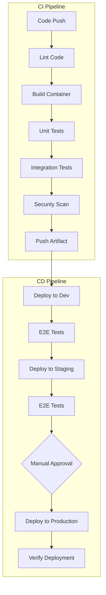

**Pipeline Configuration:**
```yaml
name: CI/CD Pipeline

on:
  push:
    branches: [ main, develop ]
  pull_request:
    branches: [ main, develop ]

jobs:
  lint:
    runs-on: ubuntu-latest
    steps:
      - uses: actions/checkout@v2
      - name: Set up Python
        uses: actions/setup-python@v2
        with:
          python-version: '3.9'
      - name: Install dependencies
        run: |
          python -m pip install --upgrade pip
          pip install poetry
          poetry install
      - name: Lint with flake8
        run: poetry run flake8 src tests
      - name: Check types with mypy
        run: poetry run mypy src

  test:
    needs: lint
    runs-on: ubuntu-latest
    steps:
      - uses: actions/checkout@v2
      - name: Set up Python
        uses: actions/setup-python@v2
        with:
          python-version: '3.9'
      - name: Install dependencies
        run: |
          python -m pip install --upgrade pip
          pip install poetry
          poetry install
      - name: Test with pytest
        run: poetry run pytest

  build:
    needs: test
    runs-on: ubuntu-latest
    steps:
      - uses: actions/checkout@v2
      - name: Build Docker image
        uses: docker/build-push-action@v2
        with:
          context: .
          push: false
          tags: self-aware-bot:${{ github.sha }}
```

**Deployment Strategies:**
- **Blue/Green:** Two identical environments, switch traffic
- **Canary:** Gradually route traffic to new version
- **Feature Flags:** Enable/disable features at runtime

### 12.5 Environment Management

The system maintains separate environments:

**Development:**
- Local development with Docker Compose
- Mocked external services
- Hot reloading for rapid iteration

**Testing:**
- Integration test environment
- Ephemeral and isolated
- Automated test data generation

**Staging:**
- Production-like environment
- Real external services with test accounts
- Performance and load testing

**Production:**
- Multi-region deployment for resilience
- Strict access controls
- Automated monitoring and alerting

**Environment Configuration:**
```yaml
# docker-compose.yml for local development
version: '3.8'

services:
  app:
    build:
      context: .
      target: development
    volumes:
      - ./src:/app/src
      - ./config:/app/config
    environment:
      - ENV=development
      - LOG_LEVEL=DEBUG
      - DATABASE_URL=postgresql://postgres:postgres@db:5432/bot
    depends_on:
      - db
      - redis

  db:
    image: postgres:13
    environment:
      - POSTGRES_USER=postgres
      - POSTGRES_PASSWORD=postgres
      - POSTGRES_DB=bot
    volumes:
      - postgres_data:/var/lib/postgresql/data

  redis:
    image: redis:6
    volumes:
      - redis_data:/data

volumes:
  postgres_data:
  redis_data:
```

### 12.6 Infrastructure as Code

The infrastructure is defined using Terraform:

```hcl
# Example Terraform configuration for AWS deployment
provider "aws" {
  region = var.aws_region
}

module "vpc" {
  source = "terraform-aws-modules/vpc/aws"
  name = "bot-vpc"
  cidr = "10.0.0.0/16"
  azs = ["${var.aws_region}a", "${var.aws_region}b", "${var.aws_region}c"]
  private_subnets = ["10.0.1.0/24", "10.0.2.0/24", "10.0.3.0/24"]
  public_subnets = ["10.0.101.0/24", "10.0.102.0/24", "10.0.103.0/24"]
  enable_nat_gateway = true
}

module "eks" {
  source = "terraform-aws-modules/eks/aws"
  cluster_name = "bot-cluster"
  cluster_version = "1.23"
  vpc_id = module.vpc.vpc_id
  subnet_ids = module.vpc.private_subnets

  node_groups = {
    application = {
      desired_capacity = 2
      max_capacity = 5
      min_capacity = 1
      instance_types = ["t3.medium"]
    }

    worker = {
      desired_capacity = 2
      max_capacity = 10
      min_capacity = 1
      instance_types = ["c5.large"]
    }
  }
}

module "rds" {
  source = "terraform-aws-modules/rds/aws"
  identifier = "bot-database"
  engine = "postgres"
  engine_version = "13.4"
  instance_class = "db.t3.medium"
  allocated_storage = 20
  storage_encrypted = true

  name = "botdb"
  username = "botadmin"
  password = var.db_password
  port = "5432"

  vpc_security_group_ids = [module.security_group.this_security_group_id]
  subnet_ids = module.vpc.private_subnets

  backup_retention_period = 7
  backup_window = "03:00-06:00"
  maintenance_window = "Mon:00:00-Mon:03:00"
}

module "elasticache" {
  source = "terraform-aws-modules/elasticache/aws"
  name = "bot-redis"
  engine = "redis"
  engine_version = "6.x"
  node_type = "cache.t3.medium"
  num_cache_nodes = 1

  subnet_group_name = aws_elasticache_subnet_group.redis.name
  security_group_ids = [module.security_group.this_security_group_id]
}
```

### 12.7 Monitoring and Observability

The architecture implements the "three pillars of observability":

**Metrics:**
- Prometheus for time-series metrics
- Custom metrics for business KPIs
- Node, container, and application-level metrics

**Logging:**
- Structured JSON logging
- Log aggregation with Elasticsearch
- Log correlation via trace IDs

**Tracing:**
- Distributed tracing with OpenTelemetry
- Request flow visualization
- Performance bottleneck identification

**Alerting:**
- Alertmanager for notification management
- PagerDuty integration for critical alerts
- Slack integration for team notifications

**Dashboards:**
- Grafana for metric visualization
- Kibana for log exploration
- Custom application dashboards

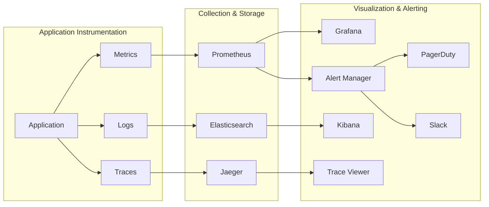

### 12.8 Disaster Recovery

The system implements multiple disaster recovery strategies:

**Backup Strategy:**
- Daily automated database backups
- Point-in-time recovery
- Multi-region backup replication

**High Availability:**
- Multi-AZ deployment
- Database replication
- Stateless application design

**Recovery Procedures:**
- Automated recovery for common failures
- Runbooks for manual recovery
- Regular disaster recovery drills

**Recovery Time & Point Objectives:**
- RTO: < 30 minutes for critical functions
- RPO: < 5 minutes for critical data

## 13. Future Enhancements and Architecture Evolution

This section outlines the potential future enhancements and evolutionary path for the system, ensuring the architecture remains adaptable to emerging technologies and changing requirements.

### 13.1 Architectural Evolution Roadmap

```mermaid
gantt
    title Architecture Evolution Roadmap
    dateFormat  YYYY-Q[Q]

    section Foundation
    Initial Implementation           :2025-Q3, 6M

    section Evolution
    Advanced Self-Awareness         :2026-Q1, 9M
    Enhanced Self-Healing           :2026-Q2, 9M
    Multi-modal Interactions        :2026-Q3, 6M

    section Scale & Integration
    Enterprise Integration          :2026-Q4, 6M
    Global Distribution             :2027-Q2, 6M
    Federated Learning             :2027-Q3, 9M
```

### 13.2 Enhanced Self-Awareness Capabilities

Future versions could implement more sophisticated self-awareness:

1. **Meta-Cognitive Framework**
   - Self-reflection on reasoning processes
   - Awareness of knowledge boundaries
   - Uncertainty quantification in decision-making

2. **Emotional Intelligence Enhancement**
   - Deeper understanding of emotional context
   - Adaptation to user's emotional state
   - Personalized interaction styles

3. **Consciousness Simulation**
   - Internal attention mechanisms
   - Subjective experience modeling
   - Self-narrative construction

### 13.3 Advanced Self-Healing Techniques

Self-healing capabilities could be extended with:

1. **Evolutionary Code Generation**
   - Genetic algorithms for code optimization
   - Multi-objective optimization for competing constraints
   - Code evolution simulations

2. **Proactive Issue Prevention**
   - Predictive analytics for potential failures
   - Pre-emptive optimization
   - Risk-aware operation modes

3. **Collaborative Self-Healing**
   - Learning from other system instances
   - Shared knowledge base of solutions
   - Distributed debugging and repair

### 13.4 Edge and Distributed Computing

The architecture could evolve toward edge deployment:

1. **Edge-Optimized Components**
   - Lightweight core for resource-constrained environments
   - Offline capability with sync when connected
   - Hardware-specific optimizations

2. **Federated Learning**
   - Privacy-preserving distributed model training
   - On-device model personalization
   - Reduced bandwidth requirements

3. **Mesh Architecture**
   - Peer-to-peer communication between bot instances
   - Load sharing and distributed processing
   - Resilience through redundancy

### 13.5 Advanced User Interfaces

Interface evolution could include:

1. **Multi-Modal Interaction**
   - Voice and natural language processing
   - Computer vision integration
   - Gesture recognition
   - AR/VR interfaces

2. **Adaptive Interfaces**
   - Interfaces that evolve based on user behavior
   - Context-aware presentation
   - Accessibility-first design approach

3. **Brain-Computer Interface Integration**
   - Direct neural interfaces when technology matures
   - Thought-based command recognition
   - Emotion detection through BCI

### 13.6 Security Evolution

Security architecture will need to evolve with emerging threats:

1. **Quantum-Resistant Cryptography**
   - Preparing for post-quantum world
   - Implementation of quantum-resistant algorithms
   - Crypto-agility for algorithm transitions

2. **Advanced Threat Protection**
   - AI-powered anomaly detection
   - Behavioral biometrics
   - Zero-trust architecture principles

3. **Privacy-Enhancing Technologies**
   - Homomorphic encryption for processing encrypted data
   - Differential privacy guarantees
   - Data minimization strategies

### 13.7 Integration Ecosystem Expansion

The integration ecosystem could expand to include:

1. **IoT Integration**
   - Smart home and device control
   - Sensor data processing
   - Ambient intelligence

2. **Extended Reality**
   - AR/VR/MR application integration
   - Spatial computing interfaces
   - 3D visualization of complex data

3. **Blockchain Integration**
   - Immutable audit trails
   - Smart contract execution
   - Decentralized identity management

### 13.8 Architectural Patterns Evolution

Emerging architectural patterns could be adopted:

1. **Cellular Architecture**
   - Autonomous, self-contained components
   - Dynamic reconfiguration
   - Resilience through isolation

2. **CQRS and Event Sourcing at Scale**
   - Separation of read and write paths
   - Event-driven state reconstruction
   - Temporal querying capabilities

3. **Micro-Frontends**
   - Composable UI components
   - Team-oriented frontend architecture
   - Consistent UX across multiple development teams

### 13.9 Technical Debt Management Strategy

A proactive approach to managing technical debt:

1. **Automated Code Modernization**
   - Self-refactoring capabilities
   - Automated dependency updates
   - Code quality metrics and thresholds

2. **Architectural Fitness Functions**
   - Automated evaluation of architectural conformance
   - Drift detection and remediation
   - Continuous architectural validation

3. **Incremental Rewrites**
   - Phased replacement of components
   - Strangler fig pattern implementation
   - Feature toggles for gradual transition

### 13.10 Research Opportunities

The system opens several research areas:

1. **Machine Consciousness Models**
   - Exploration of digital consciousness theories
   - Implementation of awareness models
   - Ethical boundaries research

2. **Trustworthy AI**
   - Explainability techniques
   - Fairness guarantees
   - Robustness certification

3. **Human-AI Collaboration Patterns**
   - Co-evolution of human and AI capabilities
   - Task delegation optimization
   - Trust-building interaction models
